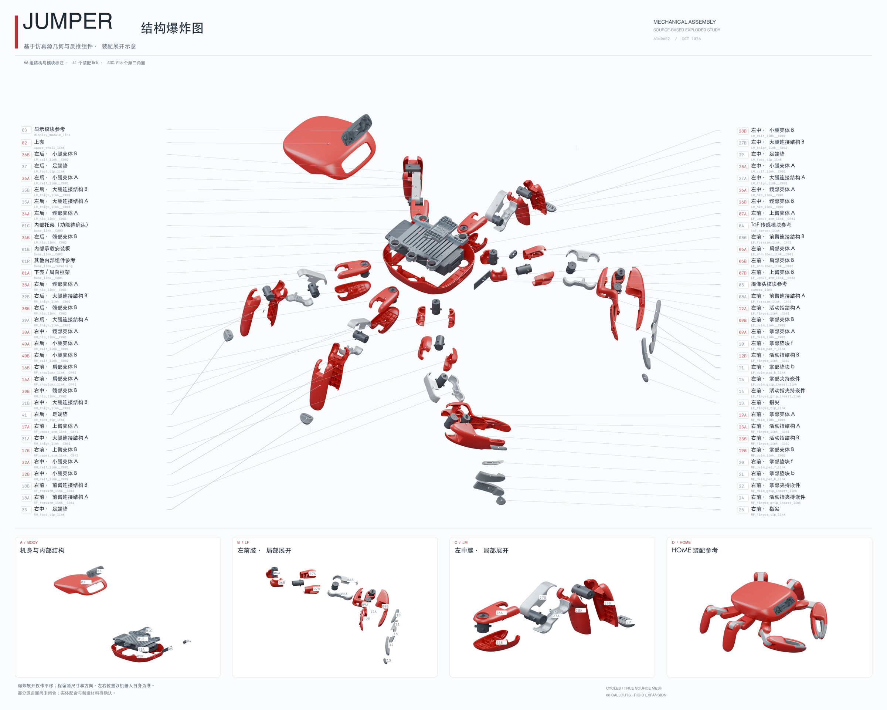

<!-- tracks: README.md @ sha256:2c2aca71bda5b9f4348b9fbf2f0f7cf063075342aa12440bdb2b0a3dabaa1427 -->

# Jumper Replica

[](https://github.com/manifoldor/jumper-replica/actions/workflows/validate.yml)
[](LICENSE)

[English](README.md) | **简体中文**

面向 [KingKong Robotics Jumper](https://github.com/KingKongRobotics/jumper) 的独立几何反推与实体试装参考项目，固定源提交 `61d065219fca767f3142c8f10aff59eae5a5a004`。当前阶段：**数字几何与参考切片已完成，尚未制造或验证实体复刻机器人**。更新于 2026-10-08（Asia/Shanghai）。



## 已有成果

- 原零件坐标下的毫米制几何：41 个 link 参考、1,364 个连通网格组件、13 个仅通过顶点焊接闭合的实体。
- 46 个经独立 CAD 内核回读验证的**分面 STEP**，保留三角面，未恢复原始参数化 CAD。
- 六件首轮试装样件：摆放后的 STL、带配置的 3MF、参考 PLA 配置和测量记录表。
- 源 HOME 姿态装配 GLB/STL、关节表、安装孔沿观测，以及 6000 × 4800、含 66 组标注的爆炸图与可编辑 Blender 场景。
- 固定版本的上游源码快照、来源与哈希、复现脚本及离线完整性验证。目录可整体移出原仓库独立使用。

这些数量描述模型表示或渲染分组，不是已确认的制造 BOM。66 组标注包含三个模块参考和一组未识别内部组件；扣除后剩余的 62 组也不代表已核实的独立制造件数量。封闭网格与切片成功不能证明配合或强度。

## 获取项目

```sh
git clone https://github.com/manifoldor/jumper-replica.git
cd jumper-replica
python3 tools/validate_release.py
```

也可通过 GitHub **Code → Download ZIP** 获取源码归档；克隆可保留版本历史。参考几何二进制直接存于 Git，无需 Git LFS。测量反馈与问题请参阅[支持说明](SUPPORT.zh.md)或使用[问题模板](https://github.com/manifoldor/jumper-replica/issues/new/choose)。

## 从这里开始

| 目标 | 文件 / 指南 |
|---|---|
| 查看整体结构 | [高清爆炸图](assembly/Jumper_Exploded_Annotated.png)、[可编辑 SVG](assembly/Jumper_Exploded_Annotated.svg)、[Blender 场景](assembly/Jumper_Exploded.blend) |
| 了解最新验证状态 | [已知信息与缺口](docs/KNOWN_INFORMATION.zh.md)、[机器可读状态](provenance/project_status.json) |
| 查找原坐标零件 | [几何指南](geometry/README.zh.md)、[组件清单](geometry/components_manifest.csv)、[STEP 文件](geometry/step_trials/) |
| 对照标注与源 ID | [标注名录](assembly/LABELS.zh.md)、[分组状态](catalog/annotated_groups.json) |
| 打印首轮试装样件 | [打印指南](printing/README.zh.md)、[试装记录表](printing/FIT_CHECKLIST.zh.md) |
| 了解源装配 | [装配指南](docs/ASSEMBLY.zh.md)、[关节表](geometry/joint_schedule.csv) |
| 复现或核验 | [复现指南](docs/REPRODUCTION.zh.md)、[贡献流程](CONTRIBUTING.zh.md) |
| 审阅开源范围 | [许可与来源](docs/LICENSING.zh.md)、[发布清单](docs/RELEASE_CHECKLIST.zh.md) |

```sh
python3 tools/validate_release.py
```

验证器仅用 Python 标准库，无需机器人、仿真器、切片器、GPU、CAD 软件或联网。需要重新生成或深入检查网格时，再安装可选依赖：

```sh
python3.12 -m venv .venv
.venv/bin/python -m pip install -r requirements-geometry.txt
```

## 目录说明

`upstream_snapshot/` 为选定的未修改源文件、原始米制 STL 和来源记录；`geometry/` 为毫米制衍生几何及提取证据；`assembly/` 为原 HOME 装配、爆炸图、标注与场景；`printing/` 为六件样件、配置和切片证据；`experiments/reference_gcode/` 说明本地生成路径的用途，公开仓库不含原始 G-code；`catalog/` 是分组状态，不是采购清单；`external_references/` 保留厂商链接与测量摘要，不含厂商 CAD 二进制；`tools/` 为独立复现和验证脚本；`docs/` 为工程状态与流程；`provenance/` 为来源、变更和哈希。

快照只包含 **51 个选定文件**，不是完整训练或控制仓库。这里没有完整的原厂固件、自定义 PCB、线束、紧固件清单、材料与公差规范，也没有经实体验证的整机装配。项目不宣称达到厂商抓取或跳跃性能。

## 许可

本项目新增脚本、文档、图注与渲染成果明确采用 [Apache-2.0](LICENSE)。源几何衍生件保留 [NOTICE](NOTICE) 中的上游署名。[许可说明](docs/LICENSING.zh.md)区分上游材料与外部参考。项目不代表厂商背书。厂商舵机 STEP 的再分发条款未确认，因此不纳入公开包。
